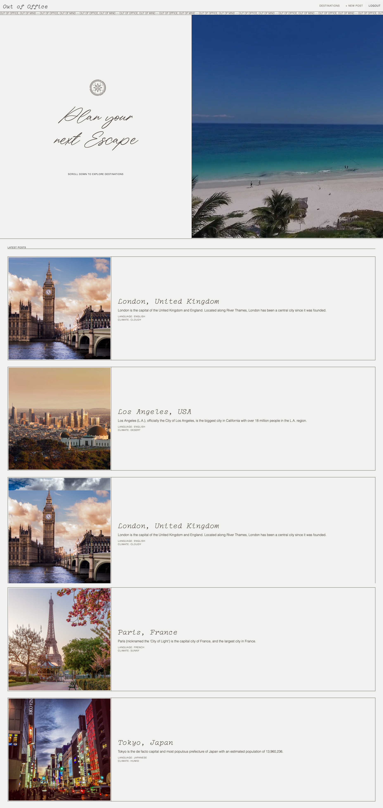

# Out of Office
## Description
"Out of Office" is a full-stack application designed for users to read about and share travel experiences.  

The goal of this project was to develop a full-stack application that showcases the skills we've developed over the course of this Coding Bootcamp. It uses Node.js and Express.js to create a RESTful API, Handlebars.js as the template engine, MySQL and the Sequelize ORM for the database, and GET and POST routes for retrieving and adding new data. The folder structure follows the MVC paradigm and the appplication protects sensitive information with environment variables. The application also uses express-sessions and cookies for user authentication. This site was (proudly!) built completely from scratch, then deployed to Heroku. It was carefully crafted to create a pleasant user experience and is both desktop and mobile friendly. A link to the deployed application can be found below.

## Table of Contents 
- [User Story](#user-story)
- [Technologies Used](#technologies-used)
- [Usage](#usage)
- [Contributors](#contributors)
- [Future Development](#future-development)

## User Story
"As a user who loves to travel, I want a full-stack application with a polished, responsive UI, so that I can share my travel experiences and read about the travel experiences of others."

## Technologies Used
* Node.js
* Dotenv
* MySQL
* Sequelize
* Express Server (routes)
* Express Session (session)
* Handlebars
* Cloudinary
* Bcrypt
* Cookies
* Insomnia Core
* JAWSDB
* Heroku
* and more!

## Usage 
[Here](https://out-of-office-app.herokuapp.com/) is a link to the deployed application.  
[Here](https://github.com/jojonah1812/out-of-office) is a link to the GitHub repository containing the application code.  
  
Below is a screenshot of the application homepage (post login):  
  

Below is a screenshot of the application homepage on mobile:  
  

## Contributors
This project was developed by [Tai Mujarin](https://github.com/ayotai), [Yasi Moshtael](https://github.com/go-yasi), [Henry Parras](https://github.com/henryparras24), and [Jonah Haase](https://github.com/jojonah1812). A breakdown of project tasks and roles can be found via the GitHub [projects boards](https://github.com/jojonah1812/out-of-office/projects).

## Future Development
It should be noted that this entire (functioning!) application was build from scratch in four business days. As a team, we are extemely proud of our progress and how quickly we were able to launch Out of Office with all of the initial functionality we set to develop. That being said, in our development, we noticed several ways we could improve and further devlop our application. Going forward, here are a few ideas we would like to implement:  
* Create a user "profile" page with a map of locations visited and "favorites" list
* Give users the option to edit and/or delete their trip posts
* Give users the option to request a new location for their trip post
* Add more location options for users to select
* Allow users to upload more than one trip photo, and create a slideshow of their photos on their post page
* Allow users to comment on others user's posts

---
DISCLAIMER: We do not claim to own any of the images used in this application. A majority of the images and videos used are open-source stock photos and/or videos.